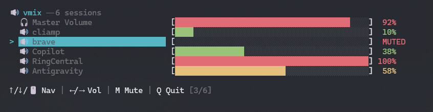

# 🔊 vmix — Minimal Modern Volume Mixer

[](https://www.python.org/)
[](https://opensource.org/licenses/MIT)
[](https://github.com/edjepaz/vmix/releases)

`vmix` is a beautifully lightweight, ultra-fast Python Terminal User Interface (TUI) for actively managing your operating system's audio volume—both your Master Output and individual application sessions concurrently.



## ✨ Why vmix?
Traditional volume mixers are cluttered. `vmix` uses a **Modern Minimalist Dashboard** to show only what you need, with high-performance hooks directly into OS audio backends.

- **🚀 Ultra-Fast Rendering**: Flicker-free terminal rendering with zero-latency response.
- **🎧 Device & Session Aware**: Mix master output and individual app volumes (Spotify, Chrome, etc) in one view.
- **🖱️ Mouse & Keyboard Responsive**: Full scroll wheel support for navigating long lists of apps.
- **📦 Zero-Impact Distribution**: Standalone binaries available for all major platforms (Windows/Linux/macOS) with no Python knowledge required.

## 🚀 Installation

### 💾 Standalone Binaries (Recommended)
Download the latest binaries for your platform from the [Github Releases](https://github.com/edjepaz/vmix/releases). No Python install or extra dependencies needed.

### 🐍 From Source
1. **Clone & Install Dependencies**:
   ```bash
   pip install psutil
   # For Windows:
   pip install pycaw comtypes
   ```
2. **Run**:
   ```bash
   python vmix.py
   ```

## 🎮 Controls

| Action | Control |
| :--- | :--- |
| **Navigate** | `↑` / `↓` or **Mouse Scroll Wheel** |
| **Adjust Volume** | `←` / `→` |
| **Toggle Mute** | `M` |
| **Refresh List** | `R` |
| **Quit** | `Q` or `Esc` |

## 🛠️ Multi-Platform Support
- ✅ **Windows**: Fully supported via native COM hooks.
- 🚧 **Linux**: PulseAudio/PipeWire integration in progress.
- 🚧 **macOS**: Core Audio abstraction planned.

---
*Created by [edjepaz](https://github.com/edjepaz) as an open-source project.*
